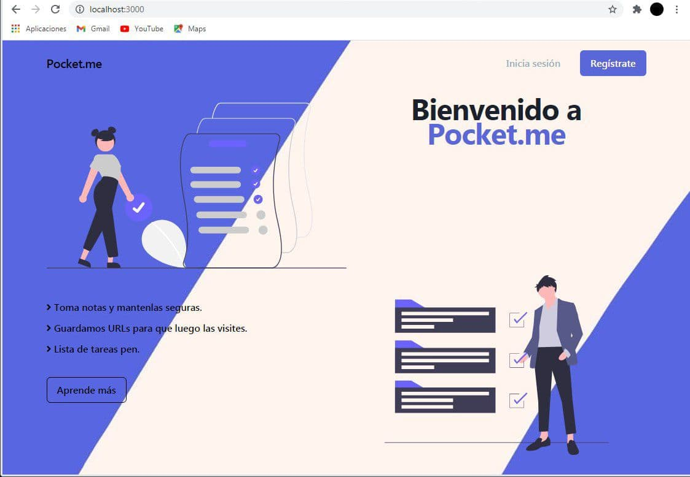
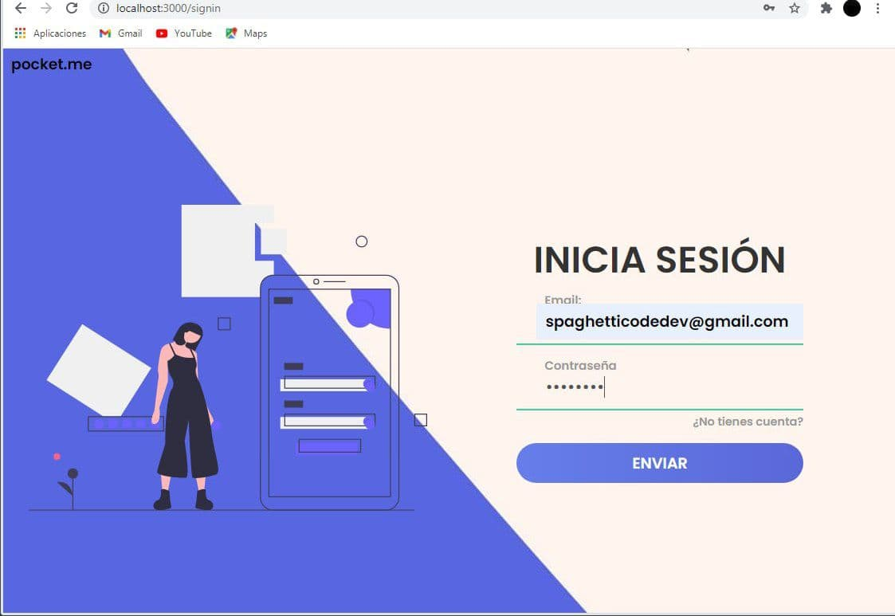
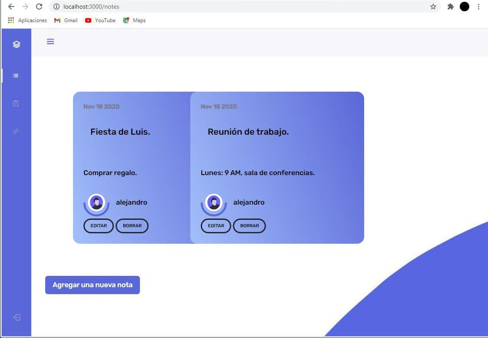

# **Pocketme**


## - Web application created using Javascript technologies inspired in [pocket](https://getpocket.com) functionalities

---

## **Example pictures:**

Home:


Signin:


Notes:


---

### **You can found a full english tutorial about how I created this project from scratch in my medium account, very soon.**

---

## Download and run the project

### **Install git:**

* [Windows user](https://git-scm.com/download/win)
* [Linux user](https://git-scm.com/book/en/v2/Getting-Started-Installing-Git)

### **Clone this repository:**

``` git
git clone https://github.com/alejandro0619/pocket.me.git
```

### **Install Nodejs:**

* [Windows user](https://nodejs.org/es/download/)
* [Linux user](https://nodejs.org/es/download/)

### **Install all dependencies:**

open your Terminal in the directory you want

```javascript
npm install
```

### **Run this project**

```javscript
npm run
```

---

## Principal technologies used in the current project

* [Javascript](https://javascript.com)
* [Nodejs](https://nodejs.org)
* [MongoDB](https://mongodb.com)

## Principal modules used in the current project

* [Expressjs](https://expressjs.com)
* [Mongoose](https://mongoosejs.com)
* [EJS](https://ejs.co)
* [Passport](https://passportjs.com)
* [Bcrypt](https://bycript-generator.com)

---

## Get in touch

Spagheticodedev@gmail.com
